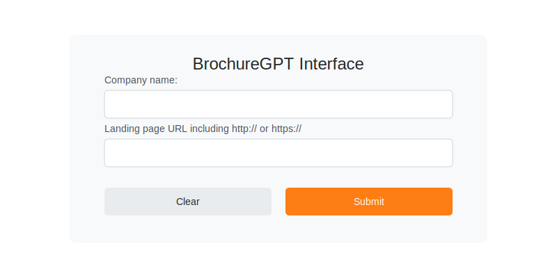
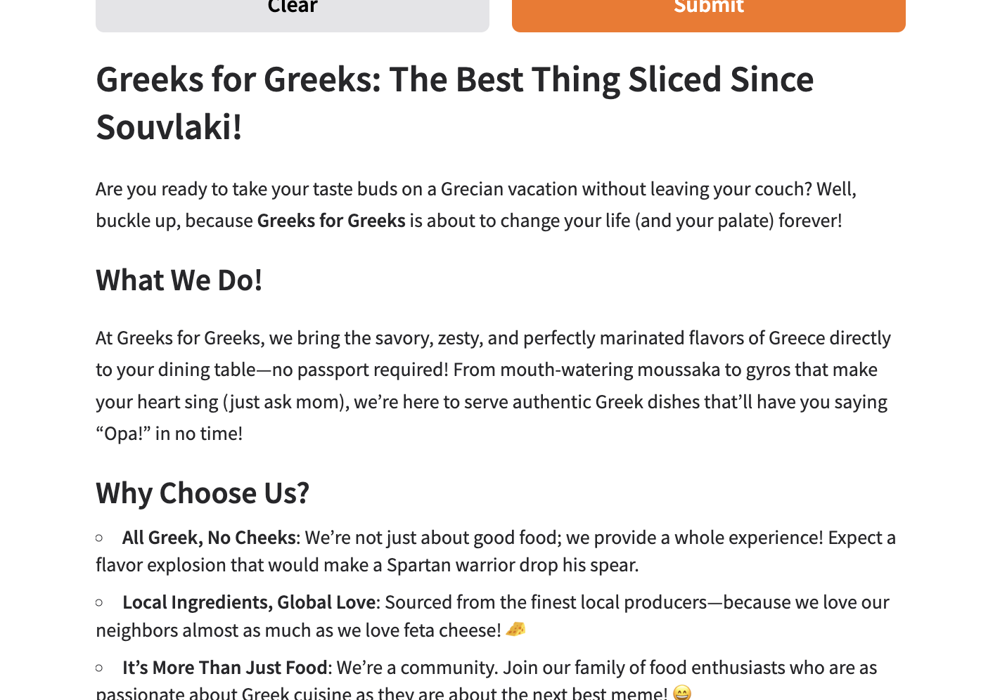

# BrochureGPT

[](https://opensource.org/licenses/MIT)
[](https://www.python.org/downloads/)

> 🚀 Automatically generate professional brochures from websites using OpenAI's GPT model

BrochureGPT is an innovative tool that transforms website content into well-structured brochures using OpenAI's GPT model. With a user-friendly Gradio interface, it makes content extraction and brochure generation a seamless process.

## ✨ Features

- 🌐 Smart web scraping to extract relevant content
- 🤖 Advanced content processing using OpenAI's GPT model
- 🎯 User-friendly Gradio interface
- 🔍 Intelligent link analysis and content structuring
- 📝 Real-time brochure generation with streaming output

## 🛠️ Prerequisites

- Python 3.11 or higher
- OpenAI API key
- Required Python packages (see [Installation](#installation))

## 🚀 Installation

1. Clone the repository:
   ```bash
   git clone https://github.com/yourusername/BrochureGPT.git
   cd BrochureGPT
   ```

2. Create and activate a virtual environment (recommended):
   ```bash
   python -m venv venv
   source venv/bin/activate  # On Windows use: venv\Scripts\activate
   ```

3. Install required packages:
   ```bash
   pip install -r requirements.txt
   ```

4. Create a `.env` file in the project root:
   ```env
   OPENAI_API_KEY=your_api_key_here
   ```

## 💻 Usage

1. Start the application:
   ```bash
   jupyter notebook Brouchure_Creation_for_Website_Using_OpenAI_Gradio.ipynb
   ```

2. The Gradio interface will launch with two input fields:
   - Company name
   - Landing page URL (including http:// or https://)

3. Enter the required information and click submit

### 📱 Interface



### 🌟 Example Output



As shown above, BrochureGPT can generate engaging, creative content for various business types. This example demonstrates a brochure for a Greek restaurant, showcasing how the tool adapts its tone and content to match different business needs.

## 🔧 Implementation Details

BrochureGPT leverages several powerful technologies:

- **BeautifulSoup4**: For efficient web scraping
- **OpenAI GPT**: For intelligent content processing
- **Gradio**: For creating an intuitive user interface
- **Python Requests**: For handling HTTP requests

### Core Components

- Website class for handling web scraping operations
- OpenAI integration for content processing
- Gradio interface for user interaction

## 🤝 Contributing

Contributions are welcome! Here's how you can help:

1. Fork the repository
2. Create a new branch (`git checkout -b feature/amazing-feature`)
3. Make your changes
4. Commit your changes (`git commit -m 'Add some amazing feature'`)
5. Push to the branch (`git push origin feature/amazing-feature`)
6. Open a Pull Request

## 📄 License

This project is licensed under the MIT License - see the [LICENSE](LICENSE) file for details.

## 🙏 Acknowledgments

- OpenAI for their powerful GPT model
- Gradio team for the excellent UI framework
- All contributors who help improve this project

---

<div align="center">
Made with ❤️ by <a href="mailto:pervali810@gmail.com">pervali810@gmail.com</a>
</div>
