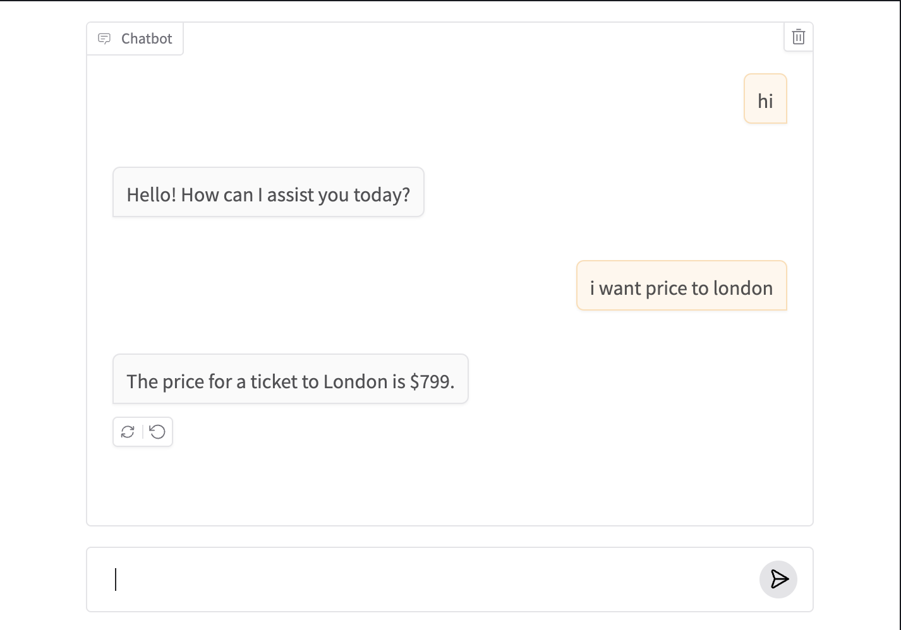
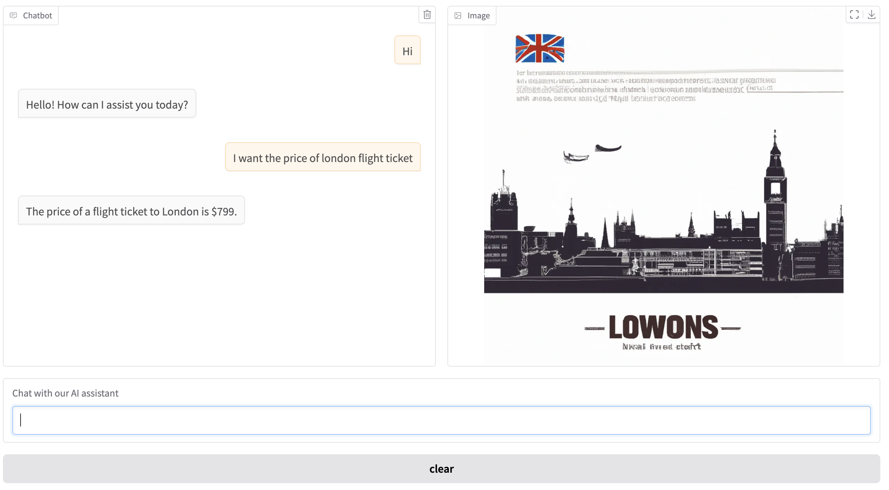

<div align="center">

# FlightMate

🛫 An advanced multimodal AI airline assistant that combines natural language processing, speech interaction, and image generation for comprehensive travel assistance.

[](https://www.python.org/)
[](https://openai.com/)
[](https://gradio.app/)
[](https://jupyter.org/)

## 📱 Interface Examples

### Basic Text-Based Assistant


### Advanced Multimodal Assistant


</div>

## 🚀 Features

- **Natural Language Understanding**: Engage in natural conversations about flight bookings and travel
- **Speech Interaction**: Voice-based interface for hands-free operation
- **Image Generation**: Visual assistance for travel-related queries
- **Tools Integration**: Seamless integration with travel and booking tools
- **Multimodal Responses**: Information through text, speech, and images
- **Intelligent Agent**: Proactive assistance and personalized recommendations


## 🛠️ Installation

1. Clone the repository

2. Install dependencies:
   ```bash
   pip install -r requirements.txt
   ```

3. Set up your environment variables:
   - Create a `.env` file in the project root
   - Add your OpenAI API key:
     ```
     OPENAI_API_KEY=your_api_key_here
     ```

4. Launch Jupyter notebook:
   ```bash
   jupyter notebook "Multimodal AI Assistant.ipynb"
   ```

## 🔧 Tools Integration

- Flight booking systems
- Travel information databases
- Weather services
- Image generation for destinations
- Text-to-speech and speech-to-text

---

<div align="center">
Made with ❤️ by <a href="mailto:pervali810@gmail.com">pervali810@gmail.com</a>
</div>